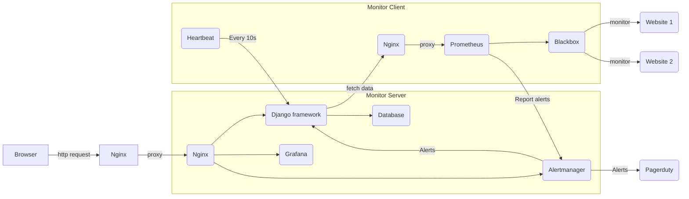

# Architecture

```mermaid
flowchart LR
  browser[Browser] -->|http request| nginx[Nginx]
  nginx -->|proxy| nginxserver
  
  subgraph Monitor Server
  nginxserver(Nginx) --> django
  nginxserver --> alertmanager
  nginxserver --> grafana
  django(Django framework) --> H(Database)
  alertmanager(Alertmanager) -->|Alerts| django
  grafana(Grafana)
  end
  
  alertmanager -->|Alerts| E(Pagerduty)
  
  subgraph Monitor Client
  heartbeat(Heartbeat) -->|Every 10s| django
  mcnginx(Nginx) -->|proxy| nginx2
  nginx2(Prometheus) -->|Report alerts| alertmanager
  nginx2 --> blackbox(Blackbox)
  end
  
  django -->|fetch data| mcnginx
  blackbox -->|monitor| s1(Website 1)
  blackbox -->|monitor| s2(Website 2)
```
